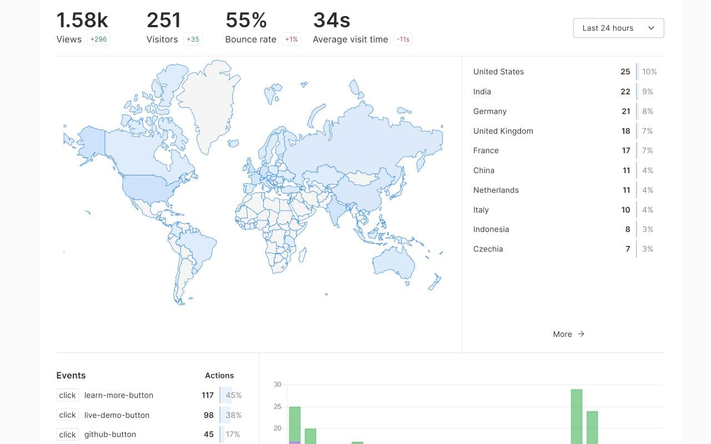

# Umami CI/CD pipeline

Deploy Umami server with CI/CD on Elestio

 
 

# Once deployed ...

You can open Umami UI here:

    URL: https://[CI_CD_DOMAIN]
    Login: admin
    password: [ADMIN_PASSWORD]
